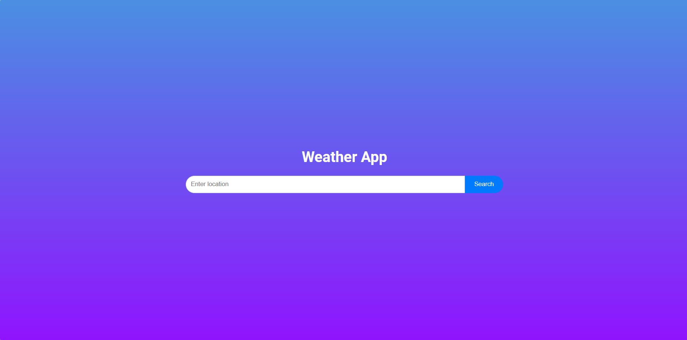
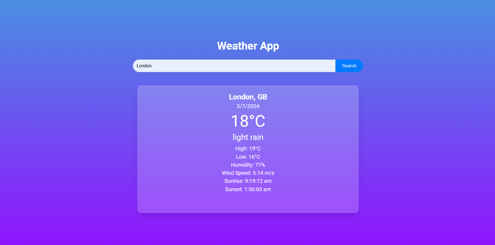

# Weather App

A web application that fetches weather data from a weather API based on the user's location or a user-inputted location. The app displays the current weather conditions, temperature, and other relevant information.

## Features

- Fetches and displays current weather data based on user location or input.
- Shows detailed current weather conditions, including temperature, humidity, wind speed, and more.
- Provides an hourly forecast for the next 8 hours.
- Displays a 5-day weather forecast.

## Technology Used

- HTML
- CSS
- JavaScript
- OpenWeatherMap API

## Screenshots

- **Screen1 :**

- **Screen2 :**

## Usage

1. Enter the location in the input field and click on the "Search" button.
2. The app will fetch and display the weather information for the entered location.

